### ¡Hola! 👋🏼 I'm Yesi

**Data & AI leader from México 🇲🇽.**

PhD in Artificial Intelligence and Google Developer Expert in Machine Learning. Currently leading data at a US–Mexico remittance fintech, and I enjoy helping LatAm startups and fintechs turn their data into real decisions.

---

#### 🛠️ Tech Stack

**AI & LLMs**  

**Data & Cloud**  

  

---

#### 📊 GitHub Stats

  

---

#### 🌎 Get in touch

---

#### 🤓 A little more
<!-- Actualiza estas líneas con lo que estés haciendo hoy -->
- 🔭 Building **yesidays** — from raw data to real impact for LatAm startups & fintechs.
- 🌱 Currently deep in data engineering, analytics & LLM-powered internal tooling.
- 💬 Ask me about **Data, Machine Learning & building data teams**.
- ⚡ Fun fact: I love kittens, mexican food and sports.
